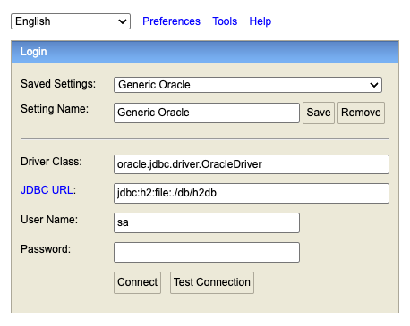

# Grid API with Spring Boot and H2 Database

Dependencies:
Java 21 and Maven 3.9.11 or higher

```sh
git config --global http.sslVerify false;
git clone https://github.com/damonew/java_api;
```

To start the application using Maven, run:
```sh
mvn spring-boot:run
```
```sh
mvn clean test
```

The application will start on the default port (usually 8080).

### SQL Scripts Directory
All database SQL scripts are located in:

    src/main/resources/sql

### 4️⃣ H2 Console Access
To view or query the database, use the H2 console at [http://localhost:8080/h2-console](http://localhost:8080/h2-console)

### H2 Console Example

Below is a screenshot of the H2 console for reference:


